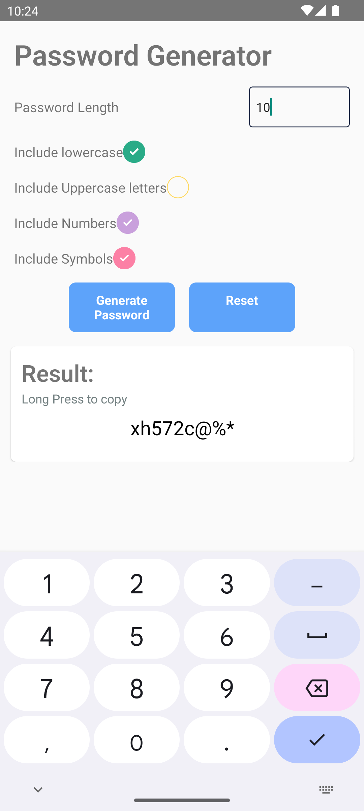

# 🔐 Password Generator App (React Native)

This is a simple and intuitive **Password Generator** app built using **React Native**. It allows users to generate strong and secure passwords with customizable length and complexity, ensuring improved online security.

---

## 🚀 Features

- Generate random, secure passwords instantly
- Set desired password length
- Toggle options for including:
  - ✅ Uppercase letters
  - ✅ Lowercase letters
  - ✅ Numbers
  - ✅ Special symbols
- Copy generated password to clipboard
- Clean UI and smooth UX

---

## 🧑‍💻 Tech Stack

- ⚛️ React Native (CLI)
- 📱 Android/iOS Compatibility
- ✨ Custom Hooks & Components
- 📦 [`@react-native-clipboard/clipboard`](https://www.npmjs.com/package/@react-native-clipboard/clipboard)

---

## 📸 Screenshots

| Home Screen | Generated Password |
|-------------|--------------------|
|  |  |

---

## 🛠️ Installation

1. **Clone the Repository**
   ```bash
   git clone https://github.com/PriyanshuPal24/React-Native.git
   cd React-Native/PasswordGenerator
2. **Install Dependencies**
   ```bash
   npm install
   # OR
   yarn install

 ---

 ## ✏️ Modify the App
 - Edit App.tsx or any component (e.g., inside components/ folder).
- To reload the app:
  - On Android: Press R twice or press Ctrl + M and choose Reload
  - On iOS: Press Cmd ⌘ + R in the simulator
    
 ---   

## 📝 License
- This project is open-source and available under the MIT License.
- Made with ❤️ by Priyanshu Pal
